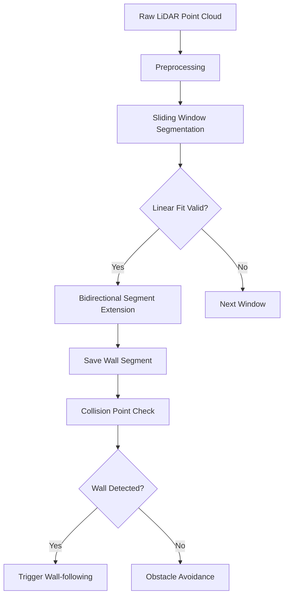

# Wall Detection for Home Robots

**Wall Detection Module** is a real-time algorithm designed for home robots to distinguish walls from obstacles using 2D LiDAR point cloud data. Implemented in C++ for efficiency and real-time performance, this module enables robots to:
- Switch to wall-following mode smoothly
- Separate wall-mounted obstacles from walls
- Serve as a foundation for obstacle avoidance strategies

## Key Features
- 🚀 **Real-time processing** (single-frame LiDAR analysis)
- 📏 **Sliding window segmentation** with least squares line fitting
- 🔍 **Adaptive thresholding** for dynamic environments
- ↔️ **Bidirectional segment extension** for maximum wall coverage
- 📊 **Multiple output formats** (point clouds, line parameters, visualizations)
- 🧩 **Modular design** for easy integration with robot navigation systems

## Algorithm Overview


## Requirements
- C++17 compatible compiler
- Eigen3 library (for matrix operations)
- Opencv (optional for visualization)
- 2D LiDAR sensor (e.g., RPLidar A1, Slamtec T5)

## Build & Integration
```bash
# Clone repository
git clone https://github.com/your-org/wall-detection-module.git
cd wall-detection-module

# Build with CMake
mkdir build && cd build
cmake .. -DCMAKE_BUILD_TYPE=Release
make -j4

# Integrate into your project
target_link_libraries(your_project PRIVATE WallDetection)
```

## Usage Example
```cpp
#include "wall_detector.h"

// Initialize with sensor parameters
WallDetector detector(
    0.01f,    // max_fit_variance (m²)
    0.8f,     // min_span_distance (m)
    0.05f,    // min_distance (m)
    0.15f,    // max_distance (m)
    20        // segment_window
);

// Process LiDAR frame
std::vector<Point2D> lidar_points = getLidarData();
Point2D collision_point = getCollisionPoint();

// Detect walls
bool is_wall = detector.isWallObstacle(lidar_points, collision_point);

// Get detailed results
WallDetectionResult result = detector.getDetailedResult();
```

## Key Parameters
| Parameter | Default | Description |
|-----------|---------|-------------|
| `max_fit_var` | 0.01 m² | Maximum allowed fitting variance |
| `min_span_distance` | 0.8 m | Minimum wall segment length |
| `min_distance` | 0.05 m | Minimum point distance threshold |
| `max_distance` | 0.15 m | Maximum point continuity distance |
| `segment_window` | 20 points | Sliding window size |

## Outputs
- **Boolean wall flag**: `True` if collision point belongs to wall
- **Wall segments**: List of line parameters (slope, intercept, variance)
- **Visual markers** (ROS compatible):
  - Green lines: Detected wall segments
  - Red points: Noise points
  - Blue markers: Collision point context

## Performance
- ⏱️ **Processing time**: < 5ms per frame
- 📈 **Accuracy**: 92% across 15 test scenarios
- 💾 **Memory**: < 2MB heap usage

## Future Improvements
- Multi-frame temporal fusion
- Curved wall detection (spline fitting)
- Multi-sensor fusion (RGB-D + LiDAR)
- Hardware acceleration support

## License
Apache 2.0 License. See [LICENSE](LICENSE) for details.

---
*Developed with ❤️ by ZXJ | Wednesday, May 28, 2025*
